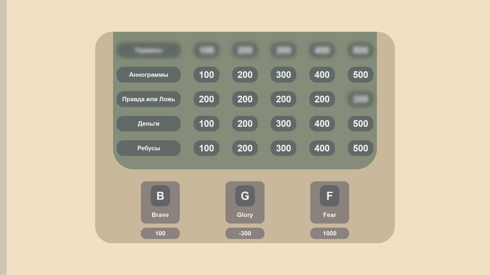

# SiGame

## Description

**SiGame** is an interactive application based on the idea of a popular game that allows users to launch question packs and answer them, with a limit of up to 5 teams. Players earn points for each correct answer, while points are deducted for incorrect answers. The application is designed to be used offline and is recommended to be used with a projector. However, to conduct the game, you will need a host who will facilitate the game. The application accepts question packs in JSON format.

## Dependencies (Development Only)

Install **[Node.js](https://nodejs.org)**, and then download all dependencies using the package manager `npm install`.

## Launch
- You can launch the pre-built installer at `si-game-electron/dist/SiGame Setup 1.0.0.exe`.
- To create a build, use `npm run build` or run the Electron application with `npm run start`.

The test question pack is located at `si-game-electron/testQuestionPack/quests.json`.

## Controls

- **Keyboard**: Use the following keys to control the game:
  - **S** - Skip question
  - **[1,2,3,4,5] number keys** - Select answering team
  - **Control+R** - Reload the application page
  - **F11** - Fullscreen mode
  - **Control+Left Click on a team** - Remove a team
  - **Y** - Correct answer
  - **N** - Incorrect answer

- **Sidebar**: Use the buttons on the left menu:
  - **X** - Go back to the question pack selection screen
  - **T** - Change color theme
  - **+** - Add a team

- **Mouse**: You can also use the mouse instead of the keyboard.
