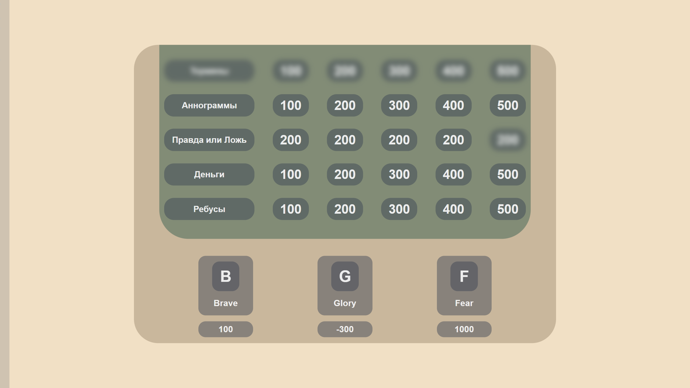

[](README.en.md)
# Своя игра



## Описание

**Своя игра** - это интерактивное приложение, основанное на идее популярной игры, которая предлагает пользователям запускать пакеты вопросов, на которые они должны отвечать, допускается не более 5 команд. За каждый правильный ответ начисляются очки, а за неправильные ответы очки сгорают. Приложение используется офлайн, рекомендуется использовать проектор. Однако, для проведения игры необходимо наличие одного ведущего, который будет вести игру. Приложение принимает пакеты вопросов в формате JSON.

## Зависимости (только для разработки)

Установить **[Node.js](https://nodejs.org/ru)**, после загрузить все зависимости через пакетный менеджер `npm install`.

## Установка и запуск

### Готовые сборки (рекомендуется)

#### Windows
- Скачайте установщик `SiGame Setup 1.0.0.exe` из Релизов
- Запустите установщи
- Приложение будет установлено в стандартную папку программ

### Сборка из исходного кода

#### Требования
- [Node.js](https://nodejs.org/ru) версии 16 или выше
- npm (устанавливается вместе с Node.js)

#### Установка зависимостей
```bash
npm install
```

#### Команды сборки
```bash
# Сборка для текущей платформы
npm run build

# Запуск в режиме разработки
npm run start
```

#### Сборка CSS
```bash
npm run build-css
```

### Тестовые данные
Тестовый пакет с вопросами находится по пути `testQuestionPack/quests.json`.

## Управление

- **Клавиатура**: Используйте следующие клавиши для управления игрой:
  - **S** - пропуск вопроса
  - **[1,2,3,4,5] цифровой блок над клавиатурой** - Выбор отвечающей команды
  - **Control+R** - Перезагрузить страницу приложения
  - **F11** - Полноэкранный режим
  - **Control+ЛКМ на команду** - Удаление команды
  - **Y** - Верный ответ
  - **N** - Неверный ответ

- **Sidebar**: Используйте кнопки на левом меню:
  - **X** - Вернуться к экрану выбора пакета с вопросами
  - **T** - Сменить цветовую тему
  - **+** - Добавить команду

- **Мышь**: Вместо клавиатуры можно использовать мышь
